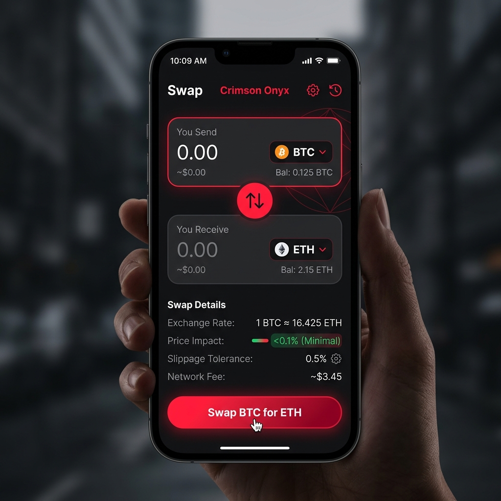

# 🛡️ CryptoWallet: The Crimson Onyx Experience


## 🌟 Overview

**CryptoWallet** is a next-generation, institutional-grade cryptocurrency management platform. Built with a focus on high-performance aesthetics and uncompromising security, it provides a seamless interface for managing digital assets across multiple blockchains.

The application follows the **Crimson Onyx Design System**—a signature blend of deep obsidian tones and vibrant crimson highlights, designed to provide a premium, fintech-first user experience.

---

## ✨ Features

- **💎 Multi-Asset Management**: Support for Bitcoin, Ethereum, Solana, and 50+ ERC-20 tokens.
- **🔄 Instant Swap**: High-liquidity token exchange with real-time price impact analysis.
- **🔐 Vault-Grade Security**: AES-256 encryption for seed phrases and local biometric authentication.
- **📈 Portfolio Analytics**: Interactive charts and performance tracking with glassmorphic cards.
- **🚀 Advanced Animations**: Fully powered by `react-native-reanimated` for silky-smooth 60FPS UI transitions.
- **🌐 Cross-Platform**: Optimized for both iOS and Android using Expo SDK.

---

## 📸 Screenshots

<div align="center">
  
  
  
</div>

---

## 🛠️ Tech Stack

- **Framework**: [React Native](https://reactnative.dev/) via [Expo](https://expo.dev/)
- **Logic**: TypeScript
- **State Management**: Redux Toolkit / Context API
- **Animations**: React Native Reanimated 3
- **Icons**: Lucide & FontAwesome
- **Theming**: Custom Crimson Onyx Engine

---

## 🚀 Getting Started

### Prerequisites

- Node.js (v18+)
- EAS CLI (`npm i -g eas-cli`)
- Expo Go app on your mobile device

### Installation

1. **Clone the repository**
   ```bash
   git clone https://github.com/0xMayurrr/CryptoWallet.git
   cd CryptoWallet
   ```

2. **Install dependencies**
   ```bash
   npm install
   ```

3. **Start the development server**
   ```bash
   npx expo start
   ```

---

## 🤝 Contributing

Contributions are what make the open source community such an amazing place to learn, inspire, and create. Any contributions you make are **greatly appreciated**.

1. Fork the Project
2. Create your Feature Branch (`git checkout -b feature/AmazingFeature`)
3. Commit your Changes (`git commit -m 'Add some AmazingFeature'`)
4. Push to the Branch (`git push origin feature/AmazingFeature`)
5. Open a Pull Request

---

## 📄 License

Distributed under the MIT License. See `LICENSE` for more information.

<p align="center">Made with ❤️ by 0xMayurrr</p>
